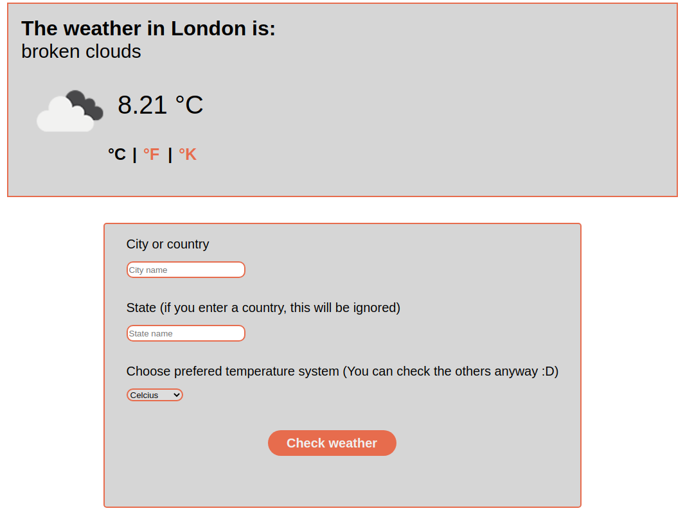

# Weather app

> This is a project for [Microverse](https://www.microverse.org/) to build a weather app using the API of [OpenWeather](https://openweathermap.org/api/one-call-api?gclid=CjwKCAjw5p_8BRBUEiwAPpJO66hGtWEMQp-sFOjbLx1lYGr-OeCm3ReKl2HQMIunydKDoF5SzoMhTBoCw84QAvD_BwE) 

In this project, you can acces to the app and look for weather in any place in the world! You just have to type the desire counrty, city or state and the page will display the weather with its temperature, wich you can choose to be shown in Celcius, Fahrenheit or Kelvin.

## Built With

- HTML
- CSS
- JavaScript
- webpack

## Live Demo

[Live Demo Link](https://livedemo.com)

To get a local copy up and running follow these simple example steps.

### Setup

- Clone this repository to your local machine and open it in a live server

👤 **Johann Rodriguez**

- Github: [@JohannRodriguez](https://github.com/JohannRodriguez)
- Twitter: [@BSapce](https://https://twitter.com/BSapce)
- Linkedin: [Johann Rodríguez](https://www.linkedin.com/in/johann-alonso-rodr%C3%ADguez-v%C3%A1zquez-25b07719a/)

## 🤝 Contributing

Contributions, issues, and feature requests are welcome!

Feel free to check the [issues page](issues/).

## Show your support

Give a ⭐️ if you like this project!

## Acknowledgments

- Hat tip to anyone whose code was used
- Inspiration
- etc

## 📝 License

This project is [MIT](lic.url) licensed.